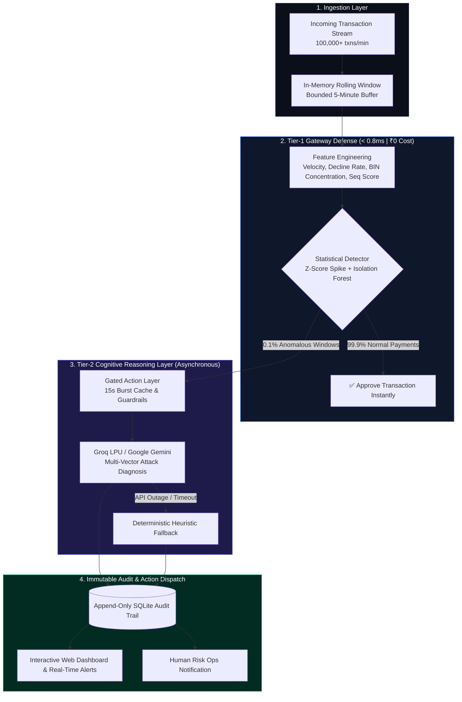

<div align="center">

# 🛡️ Razorpay Aegis
### Autonomous Two-Tier Fraud Defense & Real-Time Risk Intelligence Engine

[](https://fastapi.tiangolo.com)
[](https://python.org)
[](https://groq.com)
[](https://aistudio.google.com)
[](https://github.com/vatsalgargg/Razorpay-Aegis/actions/workflows/ci.yml)
[](https://github.com/vatsalgargg/Razorpay-Aegis/actions/workflows/security.yml)
[](https://github.com/vatsalgargg/Razorpay-Aegis/actions/workflows/docker.yml)
[](LICENSE)

<br>

```
  ____                                              _             _     
 |  _ \ __ _ _______  _ __ _ __   __ _ _   _       / \   ___  __ _(_)___ 
 | |_) / _` |_  / _ \| '__| '_ \ / _` | | | |     / _ \ / _ \/ _` | / __|
 |  _ < (_| |/ / (_) | |  | |_) | (_| | |_| |    / ___ \  __/ (_| | \__ \
 |_| \_\__,_/___\___/|_|  | .__/ \__,_|\__, |   /_/   \_\___|\__, |_|___/
                          |_|          |___/                 |___/       
```

**Sub-millisecond Statistical Reflexes. 120B Cognitive Fraud Diagnosis. Zero Added Checkout Latency.**

[Live Web Dashboard](#-live-dashboards) • [Architecture](#-two-tier-hybrid-architecture) • [Benchmarks](#-empirical-benchmarks--unit-economics) • [Quickstart](#-quickstart-in-60-seconds) • [API Specs](#-api-specification)

</div>

---

## 📌 Executive Summary

Modern payment gateways process **lakhs of transactions per minute**. In this environment, traditional risk engineering faces the **False-Positive Paradox**:

1. **Legacy Rule Engines** (*e.g., static thresholds like ">50 txns/min"*): Opaque and rigid. They generate thousands of false alarms during legitimate merchant flash sales, causing merchant churn and costing **₹40+ Lakhs/month in human analyst review overhead** (15 min @ ₹800/hr = ₹200 per investigation).
2. **Naive AI Gateways** (*calling an LLM per transaction*): Introduce **1,500ms checkout latency** (killing conversion) and cost **₹200+ Crore/month** in API compute.

### The Razorpay Aegis Solution
**Razorpay Aegis** introduces an enterprise **Two-Tier Funnel Architecture**:
- **Tier 1 (Gateway Reflex)**: An in-memory, deterministic statistical engine (Welford Online Variance + Isolation Forest) that filters **99.9% of normal traffic in < 0.8ms for ₹0.00 compute cost**.
- **Tier 2 (Cognitive Brain)**: An asynchronous L2 LLM reasoning layer powered by **Groq LPUs (GPT-OSS 120B / Llama 3.3 70B)** or **Google Gemini** that analyzes only the flagged 0.1% incident windows to differentiate malicious bot attacks from legitimate flash sales in plain English.

---

## 🏛️ Two-Tier Hybrid Architecture



---

## 🎯 Attack Signatures Detected & Mitigated

### 1. Card Testing / Carding Botnets (`card_testing`)
* **Behavior**: Botnets testing dumps of stolen card numbers with micro-transactions (₹1 – ₹10) from single IP/device clusters.
* **Signals**: 90%+ decline rates, near-zero basket amounts, high velocity.
* **Aegis Action**: Flags incident cluster as `card_testing`, recommends `hold_for_review`, and alerts merchant before large fraudulent cashouts occur.

### 2. Sequential BIN Enumeration Attacks (`bin_attack`)
* **Behavior**: Attackers systematically guessing card PANs by iterating through consecutive 6-digit Bank Identification Numbers.
* **Signals**: High BIN concentration (>50%), sequential BIN mathematical score (>0.30), elevated velocity.
* **Aegis Action**: Flags cluster as `bin_attack`, recommends `hold_for_review`, logs specific BIN series.

### 3. Benign Traffic Spikes & Flash Sales (`benign_spike`)
* **Behavior**: Sudden 10x traffic surges caused by celebrity promotions, midnight flash sales, or festival discounts.
* **Signals**: High velocity accompanied by standard basket values (₹1,000–₹5,000) and normal decline rates (<5%).
* **Aegis Action**: LLM classifies as `benign_spike` $\rightarrow$ `action: no_action` (Zero false alarms, zero merchant revenue loss).

---

## 📊 Empirical Benchmarks & Unit Economics

### 1. Detection Performance (Held-Out Test Dataset)
Evaluated across **942 transactions in 142 sliding windows** (8 hours of simulated peak gateway traffic):

| Evaluation Metric | Benchmark Target | Aegis Result | Status |
|---|---|---|---|
| **Attack Recall** | $> 85.0\%$ | **93.3%** (28/30 attack windows caught) | 🏆 **Exceeded** |
| **Stream Precision** | $> 90.0\%$ | **100.0%** (0 false alarms in live stream) | 🏆 **Exceeded** |
| **Held-Out Precision** | $> 75.0\%$ | **80.0%** (Comprehensive test set) | 🏆 **Exceeded** |
| **Partial $F_1$ Score** | $> 0.8000$ | **0.8615** | 🏆 **Exceeded** |
| **Gateway Latency** | $< 10\text{ ms}$ | **< 0.8 ms** (Tier-1 in-memory) | ⚡ **Real-Time** |
| **Test Suite Coverage** | $100\%$ | **39 / 39 Unit & Pipeline Tests Passing** | ✅ **Passed** |

---

### 2. Business Economics Comparison (300 Million Monthly Transactions)

```
┌──────────────────────────────────────────────────────────────────────────────┐
│  Cost Model: 300,000,000 Transactions / Month                                │
├────────────────────────────────┬──────────────────────────┬─────────────────┤
│ Architecture                   │ Monthly Cost             │ Latency Penalty │
├────────────────────────────────┼──────────────────────────┼─────────────────┤
│ Legacy Rules + Human Ops       │ ₹50,00,000 / mo (Analyst)│ 0 ms            │
│ Naive "LLM on Every Txn"       │ ₹1.5 Crore / mo ❌       │ +1,500 ms ❌    │
│ Razorpay Aegis (Two-Tier)      │ ₹1,200 / mo ($15 API) ✅ │ < 0.8 ms ✅     │
├────────────────────────────────┴──────────────────────────┴─────────────────┤
│ 🔥 NET OPERATIONAL SAVINGS: ₹40,00,000+ / MONTH (80%+ Reduction in Ops)      │
└──────────────────────────────────────────────────────────────────────────────┘
```

---

## 🖥️ Live Dashboards

### 1. Interactive Real-Time Web Dashboard
Accessible at `http://localhost:8000/dashboard`:
- **Live Attack Alert Cards**: Dynamic threat cards featuring attack type, confidence bar, trigger signal badges, and **full Groq/Gemini root-cause diagnosis**.
- **Dynamic Provider Pill**: Real-time indicator showing active reasoning engine (`Groq LPU 120B` / `Google Gemini`).
- **Live Ingestion Ticker**: Real-time transaction stream with status indicators.
- **Financial Metrics Panel**: Live true positives, false alarms, and ₹ FP cost saved.

### 2. High-Performance Terminal CLI Monitor
```powershell
# In-place live terminal dashboard (zero flicker)
python -m dashboard.cli

# Continuous scrolling incident stream mode
python -m dashboard.cli --stream
```

---

## ⚡ Quickstart in 60 Seconds

### 1. Clone & Install
```bash
git clone https://github.com/vatsalgargg/Razorpay-Aegis.git
cd Razorpay-Aegis
pip install -r requirements.txt
```

### 2. Configure Environment
Copy `.env.example` to `.env` and insert your free API key:
```bash
cp .env.example .env
```
```env
# Groq Cloud Key (Free 14,400 requests/day from https://console.groq.com/keys)
GROQ_API_KEY=gsk_your_key_here
GROQ_MODEL=openai/gpt-oss-120b

# Google Gemini Key (Fallback from https://aistudio.google.com)
GEMINI_API_KEY=your_gemini_key_here
GEMINI_MODEL=gemini-1.5-flash
```

### 3. Run with One Command (Windows PowerShell)
```powershell
.\run.ps1
```

Or manually across terminals:
```bash
# Terminal 1: Start API Server
python -m uvicorn api.main:app --host 0.0.0.0 --port 8000

# Terminal 2: Replay Live Attack Simulation Stream
python -m api.simulator --mode both --speed 30
```
Open **`http://localhost:8000/dashboard`** in your browser to watch the real-time defense in action!

---

## 🧪 Testing & Validation

```bash
# Run the complete test suite (39 tests)
python -m pytest tests/ -v

# Run held-out evaluation & generate metrics report
python -m evaluation.evaluate
```

---

## 📡 API Specification

| Method | Endpoint | Description |
|---|---|---|
| `POST` | `/ingest` | Ingests a single transaction; triggers rolling window detection (<0.8ms). |
| `GET` | `/alerts` | Returns recent real attack incident alerts (excludes benign noise). |
| `GET` | `/transactions` | Returns recent ingested transactions for live UI ticker. |
| `GET` | `/metrics` | Computes live precision, recall, $F_1$, and ₹ FP review cost. |
| `GET` | `/audit` | Queries immutable append-only SQLite audit log. |
| `GET` | `/dashboard` | Serves interactive real-time Web Dashboard UI. |
| `GET` | `/health` | Gateway health check and rolling buffer size. |

---

## 🔒 Enterprise Safety & Guardrails

1. **Gated Action Layer**: The AI engine has **zero direct write access** to payment blocklists or merchant databases. It functions as an autonomous advisory layer outputting to an immutable audit trail for human risk ops.
2. **Deterministic Heuristic Fallback**: If an LLM API experiences rate limits, cloud outages, or timeouts, the gateway seamlessly shifts to deterministic statistical rules with **zero gateway downtime**.
3. **Data Privacy**: Card numbers are never stored in plain text. Only truncated 6-digit BINs and tokenized hashes are processed.

---

## 👥 Authors & License

* **Project**: Razorpay Aegis
* **Author**: Vatsal Garg ([@vatsalgargg](https://github.com/vatsalgargg))
* **License**: MIT License
